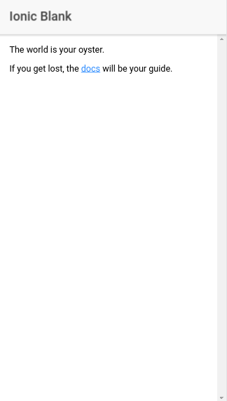

# TCM Ionic Workshop #

## Previous Knowledge

This workshop will be focused exclusively on developing Ionic applications, in order to do it in the little time available, attendees should be familiar with the following tools and concepts:

- [Git](https://git-scm.com/)
- [Npm](https://www.npmjs.com/)
- [Javascript Promises](https://developer.mozilla.org/en-US/docs/Web/JavaScript/Reference/Global_Objects/Promise)
- [Typescript](https://www.typescriptlang.org/) (You should be fine if you only know plain javascript)

## System Requirements

To speed up the start of the session and get to coding right away, it is recommended to have the following installed. Keep in mind the possibility of doing this workshop *almost* offline, since there may be some connectivity issues.

It is also recommended to do the workshop in pairs, since [pair programming](https://en.wikipedia.org/wiki/Pair_programming) often results in faster results and this is important given the time constraints.

- [Git](https://git-scm.com/downloads)
- [Node](https://nodejs.org/en/download/package-manager/#debian-and-ubuntu-based-linux-distributions) + [Npm](https://docs.npmjs.com/getting-started/installing-node)
- [Visual Studio Code](https://code.visualstudio.com/) (Any other text editor should be fine, but the workshop will be done using this)
- Clone this repository to have everything offline, use the following commands:

```
git clone https://github.com/NoelDeMartin/tcm-ionic-workshop
cd tcm-ionic-workshop
git checkout workshop-start
npm install
node_modules/.bin/ionic serve
```

If you see the following after running the commands above, you should be ready for the workshop.



## Slides

Workshop slides can be found [here](https://www.slideshare.net/NoelDeMartinFernande/tcm-ionic-workshop-83042360).
